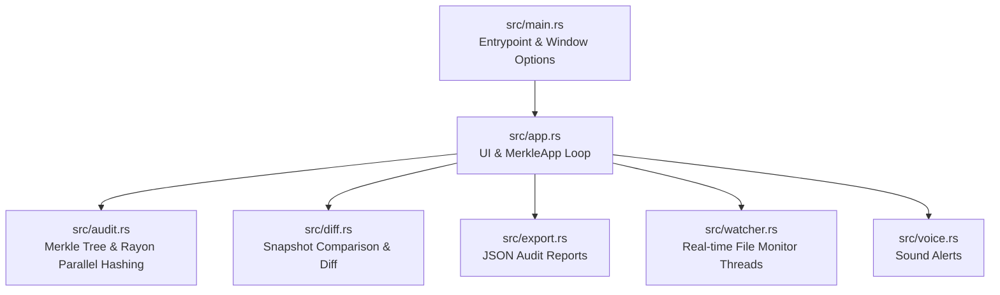

# ❖ Merkle Audit Explorer | File Integrity & Interactive Visual Canvas

[](https://www.rust-lang.org/)
[](https://github.com/emilk/egui)
[](https://en.wikipedia.org/wiki/Merkle_tree)
[]()

**Merkle Audit Explorer** es una plataforma interactiva de alto rendimiento desarrollada en **Rust** para auditar la integridad criptográfica de sistemas de archivos mediante estructuras de datos **Árbol de Merkle**. Combina un lienzo gráfico fluido estilo *Notion & Paper Scrapbook*, monitoreo en tiempo real mediante hilos asíncronos y un sistema infalible de gestión de archivos que garantiza **Cero Eliminación Accidental de Datos**.

---

## 🌟 Características Principales

### 1. 🌳 Lienzo Interactivo y Visualización en Grafo
- **Renderizado Dinámico de Árbol Merkle**: Los directorios y archivos se representan como tarjetas interactivas conectadas por aristas vectoriales con partículas animadas de flujo de información.
- **Navegación Vectorial Invariante**: Paneo $1:1$ y zoom dinámico enfocado exactamente en la posición del puntero del ratón, sin inversiones de dirección.
- **Auto-Enfoque de Subcarpetas (*Adaptive Subtree Root*)**: Doble clic en cualquier subcarpeta la enfoca como raíz del lienzo visual, simplificando la inspección de directorios masivos.

### 2. 🎨 Sistema Visual y Modos de Color
- **Modo por Extensión de Archivo (`ColorMode::ByExtension`)**: Identificación visual instantánea mediante código de colores algorítmico (PDFs en rojo, Código en verde esmeralda, Imágenes en azul cielo, Modelos CAD/BIM en violeta, etc.).
- **Modo por Antigüedad (`ColorMode::ByAge`)**: Mapeo térmico basado en la fecha de última modificación (Reciente $\le 1\text{h}$, Medio $\le 12\text{h}$, Estable $\le 7\text{d}$, Antiguo).
- **Atenuación de Opacidad en Búsquedas**: Al filtrar por extensión o término, los nodos no coincidentes reducen su opacidad al $25\%$, haciendo resaltar de forma inmediata los elementos buscados.
- **Ventana Transparente Vidrio Esmerilado (*Glassmorphism*)**: Soporte para fondos translúcidos nativos con esquinas redondeadas y estética minimalista de alta calidad.

### 3. 📦 Arrastrar & Soltar (*Notion Drag & Drop*) y Modal de Confirmación
- **Fantasmas Flotantes de Arrastre**: Vista previa translúcida que acompaña al cursor al mover elementos.
- **Modal de Confirmación Interactivo**: Al soltar un archivo sobre una carpeta destino, se despliega una ventana modal con detalles de origen, carpeta receptora, ruta completa y validación obligatoria (`✅ Confirmar y Mover` / `❌ Cancelar`).
- **Garantía de Seguridad Cero Eliminaciones**: Reubicación mediante operaciones atómicas de disco (`fs::rename`). El sistema **NUNCA** ejecuta llamadas a borrado de archivos.

### 4. 📜 Trazabilidad, Diferenciales (*Diff*) y Registro de Auditoría
- **Comparación de Snapshots (*Tree Diff*)**: Identificación precisa de archivos añadidos, modificados o eliminados entre dos momentos en el tiempo.
- **Exportación de Reportes JSON**: Generación de informes auditables completos con los hashes de cada nodo y la raíz principal Merkle.
- **Registro Inmutable (`merkle_audit_ledger.log`)**: Historial persistente de todas las operaciones y escaneos realizados.

---

## 🏗️ Arquitectura del Código

El proyecto sigue una arquitectura modular en Rust diseñada bajo el **Sistema Multi-Agente para Merkle Audit Explorer**:



### Descripción de Módulos:

| Módulo | Responsabilidad Principal |
| :--- | :--- |
| **`src/main.rs`** | Inicialización del runtime de `eframe`, configuración de ventana transparente (*ViewportBuilder*) y punto de entrada. |
| **`src/app.rs`** | Bucle principal de la interfaz `egui`, lienzo canvas de nodos, manejo de eventos de arrastrar/soltar, atenuación de opacidad y modal de confirmación. |
| **`src/audit.rs`** | Estructura de nodos del Árbol de Merkle, cálculo paralelo de hashes con **Rayon** (SHA-256 / BLAKE3) y canales de comunicación `mpsc::channel`. |
| **`src/diff.rs`** | Algoritmo de comparación diferencial entre reportes de auditoría para detectar alteraciones en la estructura de archivos. |
| **`src/export.rs`** | Serialización y deserialización de reportes de auditoría en formato JSON estandarizado. |
| **`src/watcher.rs`** | Monitoreo en segundo plano del sistema de archivos mediante la crate `notify`, enviando eventos sin congelar la interfaz. |
| **`src/voice.rs`** | Reproducción asíncrona de alertas auditivas mediante la crate `rodio`. |

---

## ⚡ Requisitos y Compilación

### Requisitos Previos:
- **Rust Compiler** (Edición 2024 o superior): [instalar rustup](https://rustup.rs/)

### Ejecución en Modo Desarrollo:
```bash
cargo run
```

### Verificación de Código y Linter:
```bash
cargo check
cargo clippy
```

### Compilación para Producción (`.exe` ejecutable):
```bash
cargo build --release
```
El ejecutable compilado y optimizado se generará en `target/release/Explorador_Archivos.exe`.

---

## 👤 Autoría y Licencia

**Desarrollado por**: Guillermo Jhoel Hernández Gómez  
**Proyecto**: Merkle Audit Explorer  
**Licencia**: Todos los derechos reservados © 2026.
